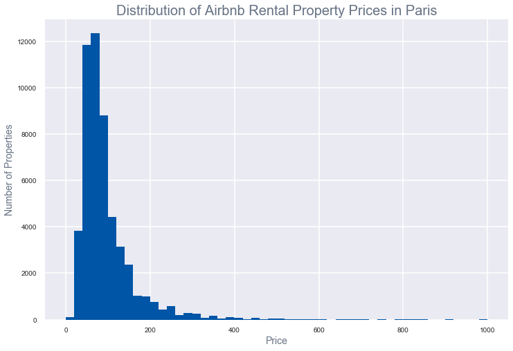
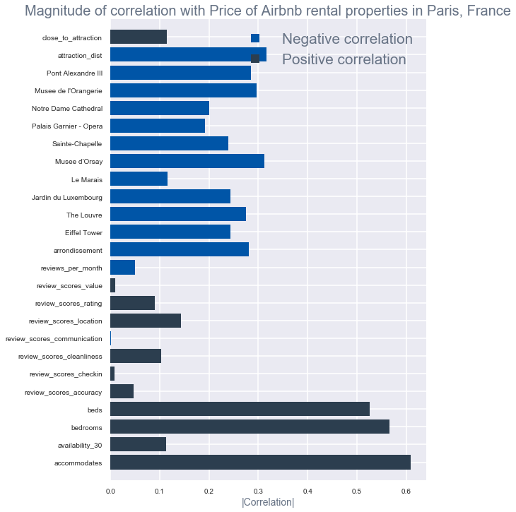
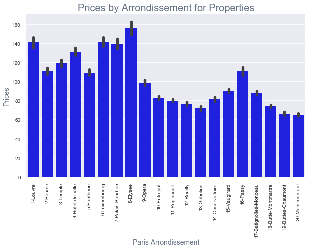

# MVP EDA Airbnb Paris

### Background

When traveling to Europe and booking an Airbnb rental property for a vacation, I try to spend less on lodging to be able to afford good dining and tours.  For Paris specifically, I find that the options close to the centre, that is close to the top attractions i.e. Eiffel tower, Champs Elysees are pricier, and most of the properties are unavailable as well, so I end up staying further from the centre, and when I do, I am always worried that I might have booked a property that is way too far out from the centre of the city, and or far from a metro station -- since actual location is not provided until after you have made the reservation, or unless you contact host and ask.  Distance to the station is relative depending on how far one is willing to walk, but for me, more than a mile to a station is considered far, since I feel I have to save all my energy for the leisurely walking one does around Paris.

### Questions for Exploration / Goals:


#### A.  Explore the following questions:

 1) How does location influence property rental price?  

* What features drive the price of an airbnb rental property? i.e. price vs location, price vs distance from a top attraction, etc.
  
  
* are the differences in price in the different arrondissements statistically significant?

 2) Can we model the airbnb rental property prices based on the features, i.e. location, distance to attraction, number of bedrooms, etc.?
   
 3) What features drive the availability of an Airbnb property?

  
 4) Can we model and predict that the property will be available for more than 5 days within the next 30 days based on the features available?

#### B.  Recommend Airbnb properties based on a specified set of features


* walking distance to one of the top attractions (within 2 miles)
* walking distance to metro station (within 1 mile)
* rating >= 9

* other user defined criteria i.e.
* number of beds
* number of bedrooms
* price range
* type of property

### Limitations
* the Airbnb data from OpenDataSoft was last updated in 2017, availability information will be based on what has been captured from the last update.
* Historical data for the property prices and availabity are not available, so we are unable to check for variability of price and availability on different seasons/time.
* For computing distances Haversine formula was used, which would be a good estimate for computing the distance between two points, but this distance could be different from the actual walking distance.


### Cleaning the Data

The geojson file format was read and used for this analysis. The original download file has eighty-six (86) columns, columns which are not needed for analysis, i.e. calendar_last_scraped, calendar_updated, listing_url, etc. were dropped to minimize columns and focus on cleaning and analysis of data which will be useful this EDA.

The 'city' column was dropped from the file as well, since all the records downloaded are those pertaining to Airbnb rental properties in Paris, France.

Further research on zipcodes was done, and found that zipcodes 75001 - 75020 correspond to Arrondissements 1 through 20 in Paris.  Since analysis will be focused on properties within the centre of Paris, the records with zipcodes outside of this range were deleted.

*More information on Paris Arrondissements in wikipedia: https://en.wikipedia.org/wiki/Arrondissements_of_Paris

### Missing Values:
Missing values in beds and bedrooms were imputed using the following rules:
* If 'beds' has a missing value, and 'bedrooms' has a valid value, 'beds' is set with the value of 'bedrooms'.
* If both 'bedrooms' and 'beds' are missing, both fields are set to 1, which is the average number of beds and bedrooms,
and it would be safe to assume that if a property is being rented out in Airbnb, that there is at least one bed, and we will count that as one bedroom, regardless if the property is a studio apartment, where there is no pyhsical division between the rooms.

There were several records as well with missing 'scores' value, a new column 'rating_ind' was created to flag rated = 1, versus unrated = 0 records, so further analysis can be done between these two populations.  The record was flagged as rated, if all the score values have been populated, and set to unrated, if at least one of the score values has not been populated.

The following fields were added to the dataset as well:

<br>1) arrondissement - this was derived from the last two digits of the zipcode

2) arrond_name - arrondissement name was populated and compared with the values populated in the neighbourhood_cleansed field.  There were some differences found, since no information is available on how the neighbourhood_cleansed field was derived, for the sake of consistency with the categorizing by Arrondissement, the arrond_name will be used for analysis instead of the neighbourhood_cleansed field.  


3) A column for each of the Distances between the Airbnb property and each of the [2018 top 10 attractions in Paris](https://www.tripadvisor.com/Attractions-g187147-Activities-Paris_Ile_de_France.html#ATTRACTION_SORT_WRAPPER) were derived as well using the [Haversine forumla](https://community.esri.com/groups/coordinate-reference-systems/blog/2017/10/05/haversine-formula), and these features were used to analyze and determine relationship with the rental property price.

["Musee d’Orsay", "Sainte-Chapelle", "Palais Garnier - Opera", "Notre Dame Cathedral", "Musee de l’Orangerie", "Luxembourg Gardens", "Louvre", "Eiffel", "Pont Alexandre III", "Le Marais"]

4) close_to_attraction - this is an indicator if the property is within 2 miles of one of the top 10 attractions

5) closest_attraction - this is the attraction closest to the Airbnb property

6) attraction_dist - distance between the Airbnb property and the closest attraction.

7) site_count - number of attractions within 1 mile of the Airbnb property


### Initial Exploration

Plotting the property prices out, shows us that the price of Airbnb rental properties in Paris  have a unimodal distribution, which is right skewed.  We can see from the graph below it shows that majority of the properties are rented out are below \$200, with the average below \$100 which is at \$94.79, with the median only at $75.  We can see that there are some outliers -- properties over \$400, causing a huge difference between the mean and the median price, and for the distribution to be right skewed.



The following features below shows the correlation with the Airbnb rental property price:
* It does make sense that the distance between the top attractions and the Airbnb property is negatively correlated with the price, and so is with the Arrondissement.  

* With regards to distance between Le Marais and the Airbnb property being positively correlated, it is possible that those properties which are farther from Le Marais are closer to the other top attractions, giving us that inconsistent correlation as far as distances from top attractions are concerned.  We can add another feature for an indicator if property is within two miles of one of the top attractions, and the top attraction it is closest to and use that for further analysis, instead of the individual distances to the top attraction.

* And as far as the other property features are concerned, we can see that the number of beds, bedrooms, and accomodations are positively correlated with the Airbnb property price.  It is expected that the bigger the accomodation is, the rental price will be higher as well.



As we saw from the correlation graph above --  Arrondissement values are negatively correlated with the price, that is, the Airbnb properties in the lower Arrondissements on average costs more than the properties in the higher arrondissements, which is what the graph below shows.



If we look at each of our top 10 attractions in Paris, we can see that the attractions are in arrondissements 1 through 8.

With regards to the availability the graphs below shows that the price does have direct relationship on the availability of the Airbnb rental properties in Paris, but the availability by arrondissements seem to be pretty consistent across all arrondissements, with the exception of arrondissements 8 and 16.  

The graph on Prices by Arrondissement shows that property prices are highest in arrondissement 8, which will be consistent with the high availability in that arrondissement.  However, for arrondissement 16, it is possible that the distance to attractions could be a factor, and we can explore that further.


### Initial Research Findings

Based on initial Exploratory Analysis, we can see that:

* the lower priced Airbnb properties have less availability, this would affect the probability of finding a property for at that lower price range i.e. for a less than \$100/night budget

* the properties in the lower Arrondissements, those closest to the top attractions cost more on average compared to the properties in the higher arrondissements.


### Further Research and Analysis

* Further explore properties in the desired criteria:
<br> properties less than \$100/night
<br> distance within 2 miles of one of the top attractions
<br> properties with 1 bed, accommodates less than or equal to 2

* Determine how the distance to the top attractions affect the price

* Determine how the distance to the metro affects the price

* Recommend top 20 properties given a certain criteria


```python

```
